# Smart Home Android App

Android application for the Smart Home System project developed as part of the Software Engineering course [DA330B](https://www.hkr.se/kurs/da330b/) at Kristianstad University.

The app allows users to monitor and control smart home devices through a modern mobile interface built with Kotlin and Jetpack Compose.

## Related Repositories

This project is part of a larger smart home ecosystem consisting of multiple repositories.

- [Android Application](https://github.com/SoftwareEngineering-HKR/andriod)
- [Backend Service](https://github.com/SoftwareEngineering-HKR/backend)
- [Web Application](https://github.com/SoftwareEngineering-HKR/frontend)
- [Device Integration](https://github.com/SoftwareEngineering-HKR/IOT)


## Features

- Smart home device management
- Real-time device status updates
- WebSocket communication (persistent connection)
- User authentication
- Modern UI built with Jetpack Compose
- Material Design based interface


## Tech Stack

- Kotlin
- Jetpack Compose
- Android Studio
- Gradle
- Material Design 3
- WebSockets


## Getting Started

### Requirements

- Android Studio (latest stable version recommended)
with Android SDK installed
- JDK 11 (as required by project Gradle configuration)
- Android Emulator or physical Android device

> **Project configuration note:**
> - Minimum SDK: 24
> - Target SDK: 36
> - Compile SDK: 36
> - Kotlin JVM target: 11


### Running the Application
1. Clone the repository:

```bash
git clone https://github.com/SoftwareEngineering-HKR/andriod.git
```

2. Open the project in Android Studio

3. Allow Gradle sync to complete

4. Run the application using:
   - Android Emulator
   - or a connected physical Android device


## Backend Connection

The application requires the backend service to be running in order to function correctly.

Communication between the app and backend is handled through WebSocket communication (persistent connection).


## Screenshots

### Authentication
When opening the app, users can either sign in to an existing account or create a new one. The authentication flow is designed to be simple and intuitive.

<p align="center">
  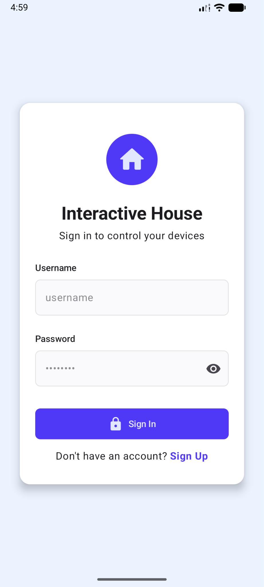
  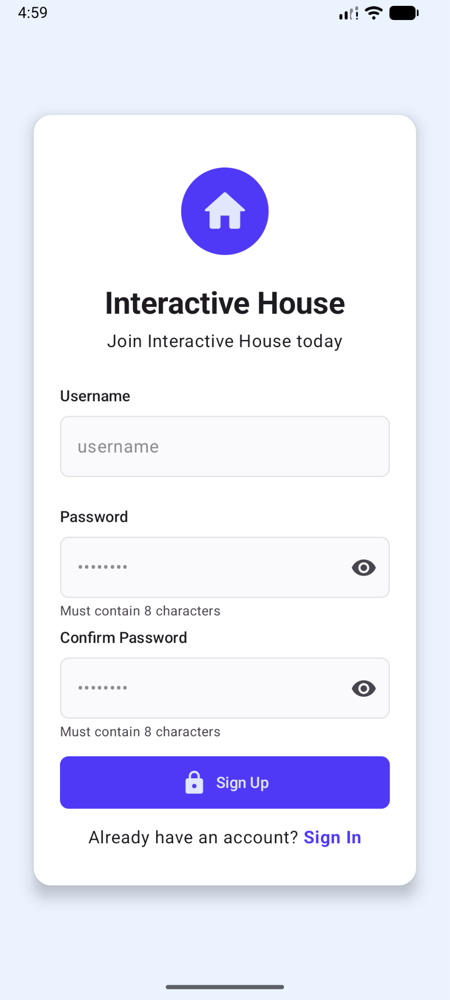
</p>

---

### Devices
The device overview screen provides a complete overview of all connected devices in the household. Devices are grouped by room, display their current status or values in real time, and allow users to quickly interact with them directly from the overview.

<p align="center">
  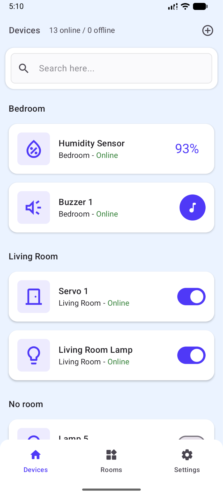
</p>

---

### Searching
Users can quickly find devices using the built-in search functionality. Devices can be filtered by name, room, or device type, making navigation efficient even in larger households.

<p align="center">
  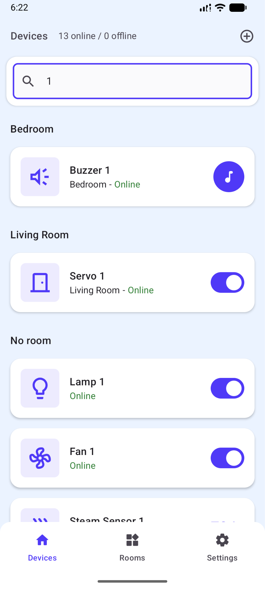
  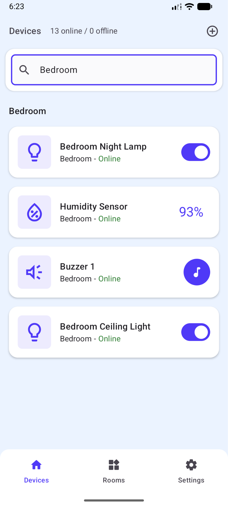
  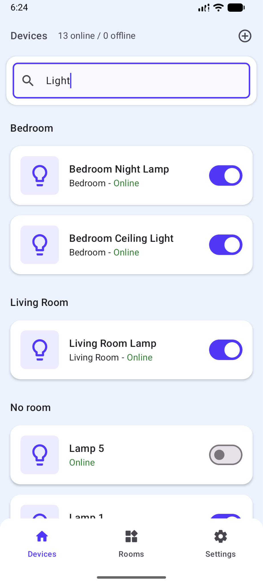
</p>

---

### Device Specific Interactions
Each device type provides its own tailored interaction interface. In addition to the common device controls, specialized devices expose additional functionality such as brightness and color controls for lights, password management for locks, or value management for displays.

<p align="center">
  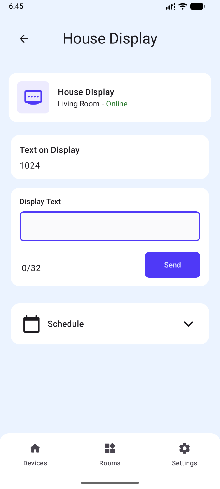
  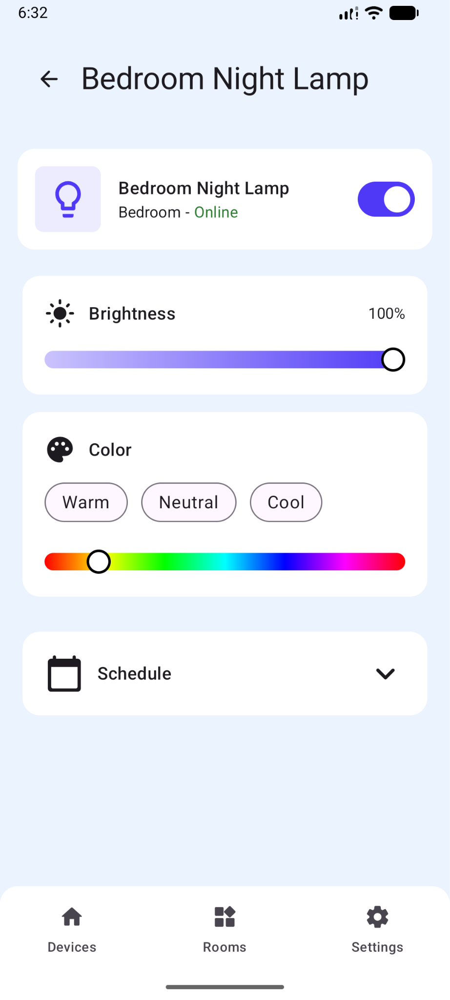
  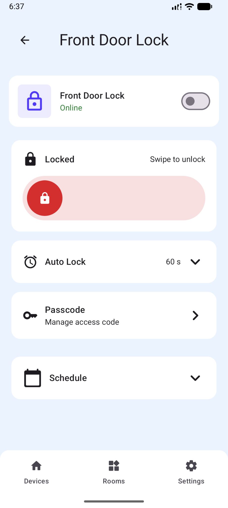
</p>

---

### Rooms
The rooms overview screen allows users to manage devices on a room level. Users can perform group interactions, such as turning all compatible devices in a room on or off, while also being able to open individual rooms to view all contained devices.

<p align="center">
  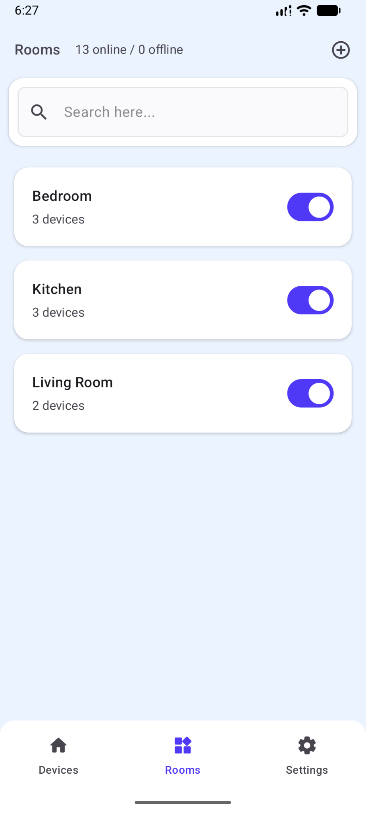
  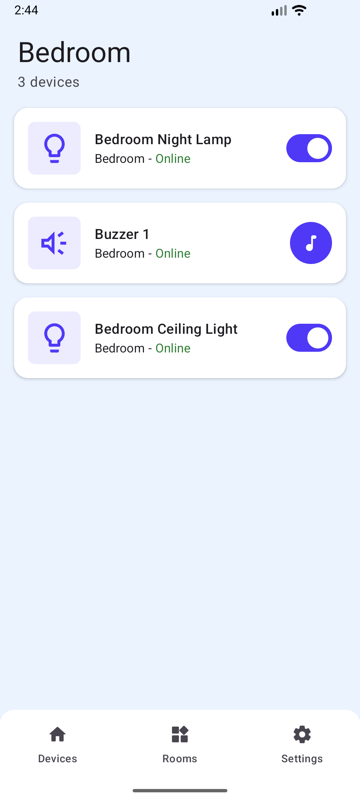
</p>

---

### Role-based Control
The application supports role-based access control. Standard users have access to the core functionality of the application, while administrator accounts gain access to additional household management features and configuration options.

<p align="center">
  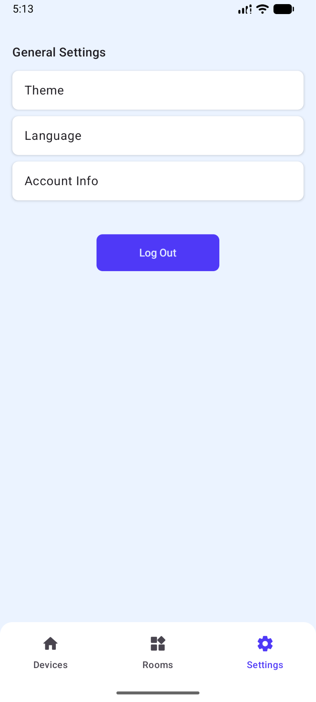
  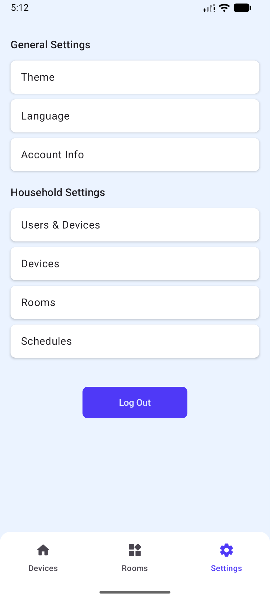
</p>

---

### Management (Admin Specific)
Administrators can manage household resources directly from the application, including devices, rooms, and users. These management tools allow the household configuration to be maintained entirely through the mobile interface.

<p align="center">
  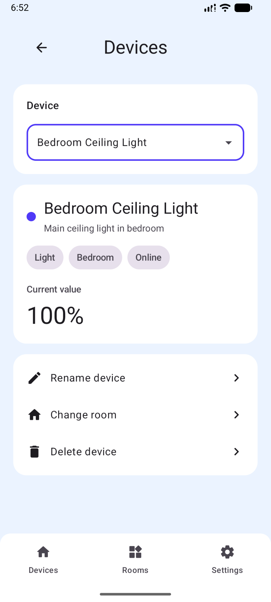
  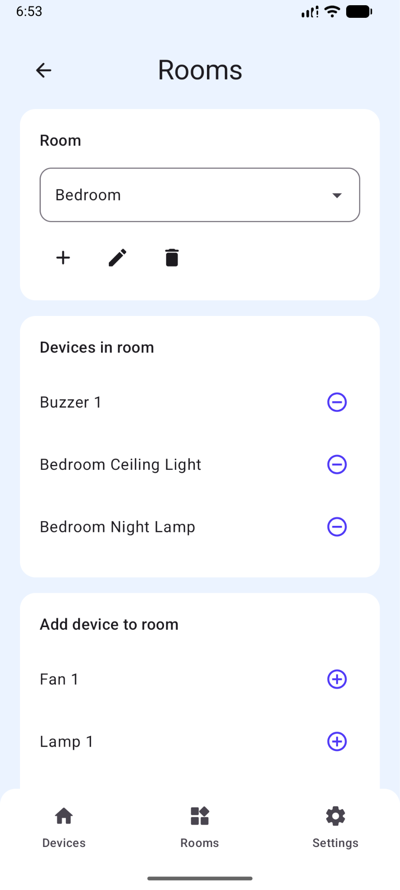
  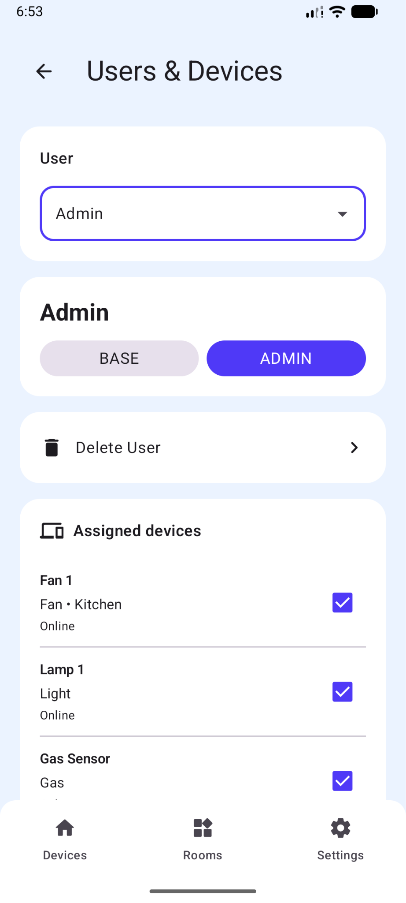
</p>

---

### Themes
The application supports both light mode and dark mode, while also allowing users to follow the system default theme automatically. This provides a flexible experience that adapts to user preferences and device settings.

<p align="center">
  
  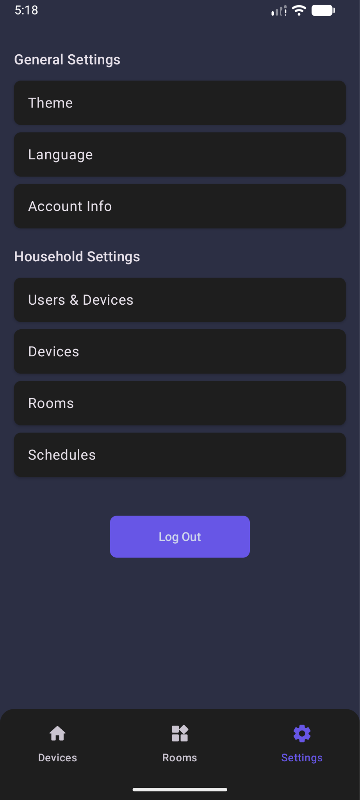
</p>

---

### Languages
The user interface is fully localized and currently supports multiple languages, including English, Swedish, and Hungarian.

<p align="center">
  
  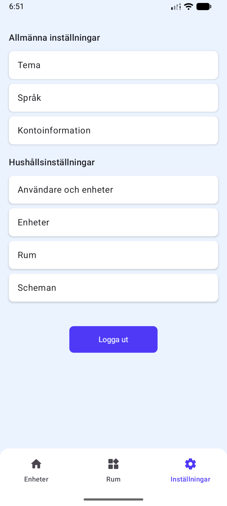
  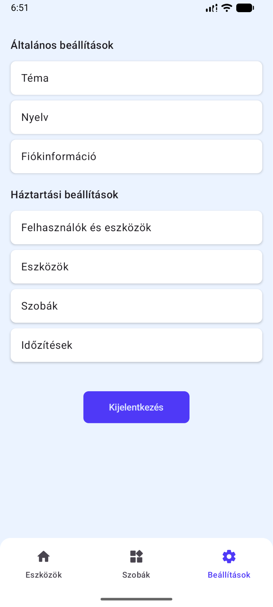
</p>


## Future Work
- Allowing Users to Change Username
- Allowing Users to Reset Their Password
- Support for Scheduling Devices (Based on Time or Sensor Values)
- Support for Additional Device Types
- Functional Hue Selector for Lights
- High Contrast Theme
- Additional Languages


## License

This project is licensed under the GNU General Public License v3.0.

See the [LICENSE](LICENSE) file for more information.
